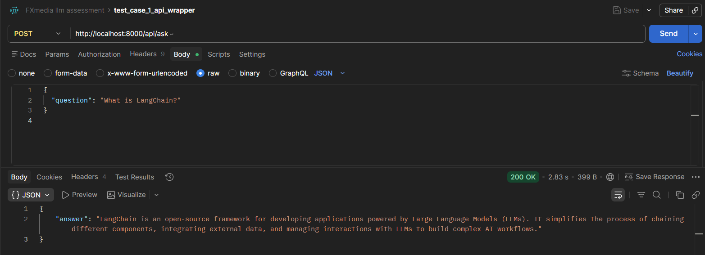
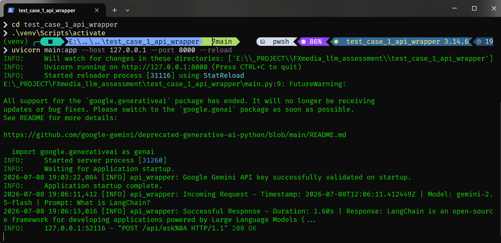
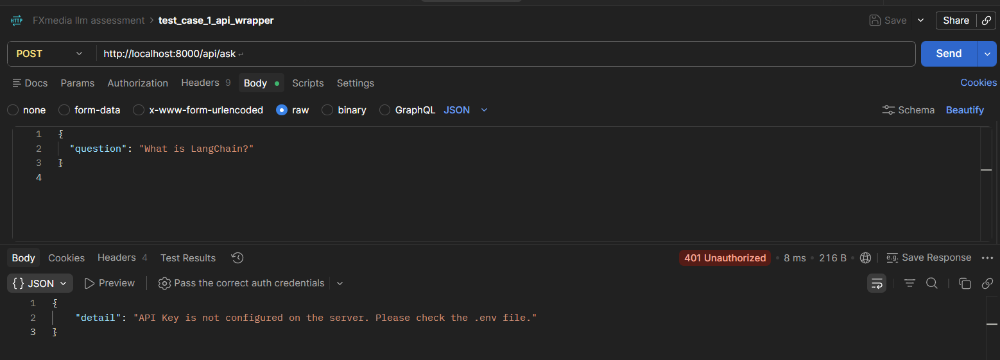
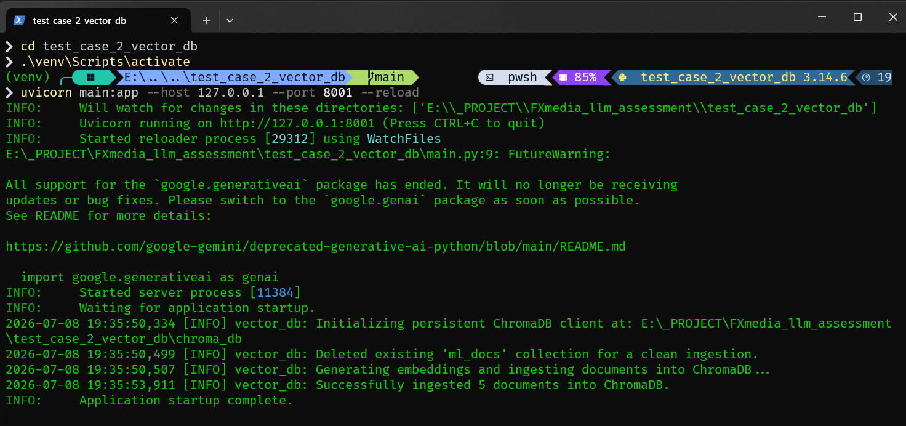
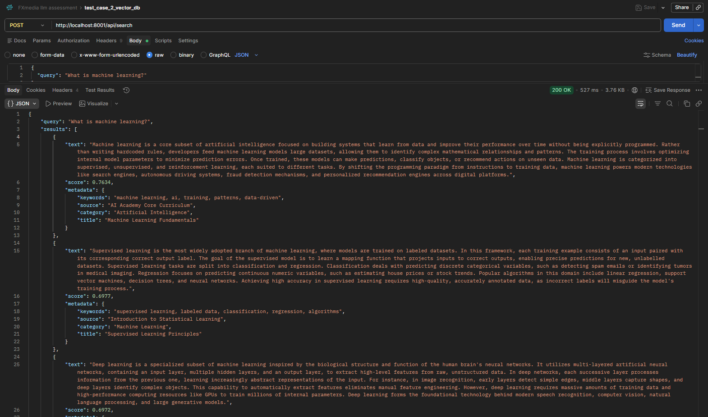
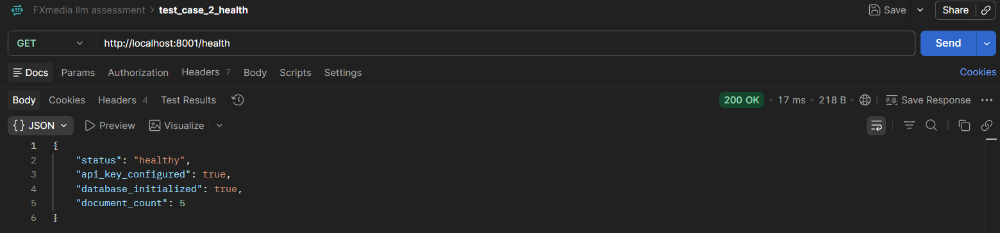
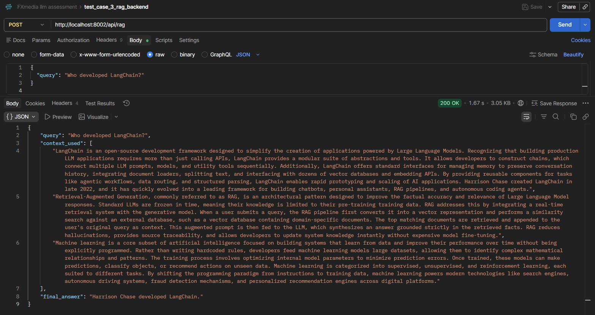
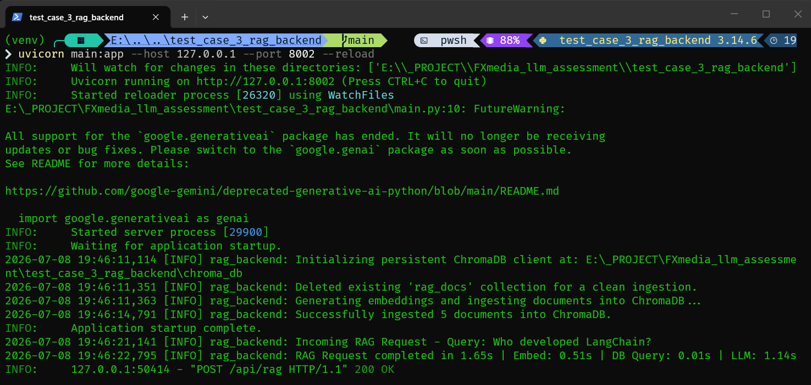

# LLM Developer Intern - Technical Assessment Solution

This repository contains the complete and verified solutions for the LLM Developer Intern Technical Assessment. All tasks are built using **Python**, **FastAPI**, **ChromaDB**, and the **Google Gemini API**.

---

**Kandidat:** [Zulvikar Kharisma](https://zulvikar.is-a.dev/)  
**GitHub:** [@DycandX](https://github.com/DycandX)  |  **Portfolio:** [zulvikar.is-a.dev](https://zulvikar.is-a.dev/)  |  **LinkedIn:** [linkedin.com/in/zulvikar-kharisma](https://www.linkedin.com/in/zulvikar-kharisma/)  
**Email:** [zulvikar.kharisma22@gmail.com](mailto:zulvikar.kharisma22@gmail.com)

---

## 📋 Table of Contents

- [Repository Structure](#-repository-structure)
- [Technical Decisions](#-technical-decisions)
- [Quick Start & Setup](#-quick-start--setup)
- [Verification Commands](#-verification-commands)
- [Screenshots](#-screenshots)

---

## 📂 Repository Structure

The project is structured into separate, modular, and self-contained directories for each test case:

```text
├── .gitignore
├── README.md
├── test_case_1_api_wrapper/     # Test Case 1: FastAPI endpoint wrapping Gemini LLM
│   ├── main.py
│   ├── requirements.txt
│   └── .env.example
├── test_case_2_vector_db/       # Test Case 2: ChromaDB integration & Similarity Search
│   ├── main.py
│   ├── documents.json
│   ├── requirements.txt
│   └── .env.example
├── test_case_3_rag_backend/     # Test Case 3: Simple RAG pipeline (Vector Search + LLM generation)
│   ├── main.py
│   ├── documents.json
│   ├── requirements.txt
│   └── .env.example
└── test_case_4_graph_rag/       # Test Case 4: Conceptual Graph RAG Explanations
    ├── graph_rag.en.md
    └── graph_rag.id.md
```

---

## ⚡ Quick Start & Setup

### 1. Prerequisites
- Python 3.10 or higher installed.
- A valid **Google Gemini API Key** (from [Google AI Studio](https://aistudio.google.com/)).

### 2. Configure Environment Variables
Inside each folder (`test_case_1_api_wrapper`, `test_case_2_vector_db`, and `test_case_3_rag_backend`), copy the `.env.example` template to `.env` and fill in your Gemini API Key:

```bash
# Example for Test Case 1 (do the same for folders 2 and 3)
cp test_case_1_api_wrapper/.env.example test_case_1_api_wrapper/.env
```

```bash
# Example for Test Case 2
cp test_case_2_vector_db/.env.example test_case_2_vector_db/.env
```

```bash
# Example for Test Case 3
cp test_case_3_rag_backend/.env.example test_case_3_rag_backend/.env
```

Open the newly created `.env` file and replace the placeholder:
```env
GEMINI_API_KEY=your_actual_gemini_api_key_here
```

### 3. Install & Run (Step-by-Step)

#### Test Case 1: LLM API Wrapper (Port 8000)
```bash
cd test_case_1_api_wrapper
python -m venv venv
# On Windows:
.\venv\Scripts\activate
# On macOS/Linux:
source venv/bin/activate

pip install -r requirements.txt
uvicorn main:app --host 127.0.0.1 --port 8000 --reload
```

#### Test Case 2: Vector Database (Port 8001)
```bash
cd ../test_case_2_vector_db
python -m venv venv
# Activate virtual environment...
pip install -r requirements.txt
uvicorn main:app --host 127.0.0.1 --port 8001 --reload
```

#### Test Case 3: Simple RAG Backend (Port 8002)
```bash
cd ../test_case_3_rag_backend
python -m venv venv
# Activate virtual environment...
pip install -r requirements.txt
uvicorn main:app --host 127.0.0.1 --port 8002 --reload
```

---

## ⚙ Technical Decisions

| Decision | Rationale |
|---|---|
| **LLM Provider: Gemini** | Free tier, built-in embedding `text-embedding-004`, no OpenAI key required |
| **Vector DB: ChromaDB** | Local, persistent, zero cloud infra — fits assessment scope |
| **Sync endpoints (not async)** | Each test case standalone; async adds no benefit here |
| **Modular per folder** | Per instructions — each folder runs independently |
| **No auth / rate limiting** | Outside test scope; production-ready auth needs separate middleware |

---

## 🔍 Verification Commands (cURL & PowerShell)

### 📮 Postman Collection
Import the pre-configured collection into Postman:
* **File:** [`docs/FXMedia-Assessment.postman_collection.json`](docs/FXMedia-Assessment.postman_collection.json)

**How to import:**
1. Open Postman
2. `File` → `Import` → select the file above
3. Click **Import**

3 requests ready (TC1, TC2, TC3). Just click **Send** once the server is running.

### Test Case 1: LLM Wrapper (POST `/api/ask`)
* **cURL**:
  ```bash
  curl -X 'POST' 'http://127.0.0.1:8000/api/ask' \
    -H 'Content-Type: application/json' \
    -d '{"question": "What is LangChain?"}'
  ```
* **PowerShell**:
  ```powershell
  (Invoke-RestMethod -Uri "http://127.0.0.1:8000/api/ask" -Method Post -ContentType "application/json" -Body '{"question": "What is LangChain?"}') | ConvertTo-Json
  ```

### Test Case 2: Vector DB Search (POST `/api/search`)
* **cURL**:
  ```bash
  curl -X 'POST' 'http://127.0.0.1:8001/api/search' \
    -H 'Content-Type: application/json' \
    -d '{"query": "What is machine learning?"}'
  ```
* **PowerShell**:
  ```powershell
  (Invoke-RestMethod -Uri "http://127.0.0.1:8001/api/search" -Method Post -ContentType "application/json" -Body '{"query": "What is machine learning?"}') | ConvertTo-Json -Depth 5
  ```

### Test Case 3: Simple RAG (POST `/api/rag`)
* **cURL**:
  ```bash
  curl -X 'POST' 'http://127.0.0.1:8002/api/rag' \
    -H 'Content-Type: application/json' \
    -d '{"query": "Who developed LangChain?"}'
  ```
* **PowerShell**:
  ```powershell
  (Invoke-RestMethod -Uri "http://127.0.0.1:8002/api/rag" -Method Post -ContentType "application/json" -Body '{"query": "Who developed LangChain?"}') | ConvertTo-Json -Depth 5
  ```

---

## 📸 Screenshots

Below are the visual verifications of the running services, logs, and error-handling capabilities:

### 1. Test Case 1: LLM API Wrapper
* **Success Response (`/api/ask`)**:
  
* **Uvicorn Console Logs**:
  
* **Error Handling (401 Unauthorized)**:
  

### 2. Test Case 2: Vector Database Integration
* **Database Ingestion on Startup**:
  
* **Search Results with Similarity Scores (`/api/search`)**:
  
* **Health Check Endpoint (`/health`)**:
  

### 3. Test Case 3: Simple RAG Backend
* **RAG Prompt & Response (`/api/rag`)**:
  
* **Uvicorn Console Logs (Modular Durations)**:
  

